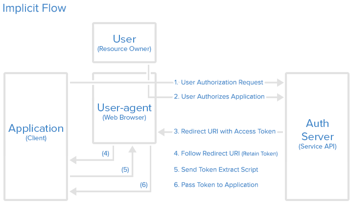

OAuth 2.0
=========

## Notes and other stuff

- [OAuth 2.0](#oauth-20)
  - [Notes and other stuff](#notes-and-other-stuff)
    - [Introduction](#introduction)
    - [Ruoli OAuth e Flusso](#ruoli-oauth-e-flusso)
  - [Registrazione dell'applicazione](#registrazione-dellapplicazione)
  - [Authorizazione Grant](#authorizazione-grant)
    - [Authorization Code Flow](#authorization-code-flow)
    - [Grant type: Implicit](#grant-type-implicit)
    - [Grant Type: Resource Owner Password Credentials](#grant-type-resource-owner-password-credentials)
    - [Grant Type: Client Credentials](#grant-type-client-credentials)
  - [Resources](#resources)

### Introduction

OAuth (Open Authorization) 2.0 è un authorization framework per l'access delegation. Viene utilizzato comunemente dagli utenti per garantire (grant) ad applicazioni o websites accesso alle loro informazioni ma senza dar loro password.

### Ruoli OAuth e Flusso

OAuth 2 definisce il seguente flusso astratto


Il flusso sopra rappresentato vede coinvolti i seguenti ruoli:

- **Resource Owner**: ovvero l'utente (*User*) il quale autorizza un'applicazione ad accedere al proprio account.

    In particolare il Resource Owner si occupa di autorizzare la richiesta di accesso da parte del Client. Altrimenti detto il Resource Owner  "*concede*" l'autorizzazione al Client, ovvero il Client riceve una concessione di autorizzazione (*authorization grant*) alla sua richiesta.

- **Client**: ovvero l'applicazione (*Application*) che vuole accesso all'account utente. Prima di poter fare questo deve poter essere validata dall'API (Application Programming Interface)

- **Resource Server**
Ospita l'account utente (e le sue risorse)

- **Authorization Server** si occupa di verificare che l'identità dell0utente e quindi emette un token di accesso (*access token*)

**Nota**: dal punto di vista dello sviluppatore l'API del servizio ricopre sia il ruolo di Resource Owner che di Resource Server. (opinabile)

## Registrazione dell'applicazione

Prima di utilizzare OAuth occorre registrare la propria applicaizone. A tal fine vengono solitamente richieste le seguenti informazioni:

- *Application Name*
- *Redirect URI o Callback URL*, ovvero dove il servizio effettuerà redirezione dopo che è stata autorizzata o meno la propria applicazione. Nel caso di autorizzazione si attende che a questo indirizzo risponda la parte dell'applicazione che si occuperà di gestire il token di autorizzazione (Authorization Code) o il token di acccesso (Authorization Token).

Una volta che l'applicazione è registrata vengono emessi dal servizio le credenziali del client (*client credential*) come:

- *client identitifer*: stringa pubblica utilizzata dalla API per identificare l'applicazione. E' utilizzta per creare le URL di autorizzazione.
- *client secret*: utilizzato per autenticare l'identità dell'applicazione (deve rimanere privata tra applicazione e API)

## Authorizazione Grant

Può essere di differenti tipologie. Ad ora sono definite 4 tipologie:

- **Authorization Code**
- **Implicit**
- **Resource Owner Password Credentials**
- **Client Credentials**

### Authorization Code Flow


Steps:

1) **Authorization Code Link**: l'utente richiede un authorization code.

    ```http
    https://cloud.digitalocean.com/v1/oauth/authorize?response_type=code&client_id=CLIENT_ID&redirect_uri=CALLBACK_URL&scope=read
    ```

    **Note**:
    - nel tipo di risposta il Resource Owner, ovvero l'utente in questo caso, richeide un Authorization Grant di tipo Authorization Code.
    - lo scope  identifica il livello di accesso che l'applicazione sta richiedendo

2) **User Authorizes Application** :l'utente authorizza l'applicazione

    L'utente deve autenticare la propria identità (log in). Quindi gli viene chiesto di autorizzare (authorize) o non autorizzare (deny)l'accesso al proprio account.

3) **Application Receives Authorization Code** : l'applicazione riceve un Athorization Code

    *Nota*: l'authorizazione code viene mandato alla callback

    ```http
    https://dropletbook.com/callback?code=AUTHORIZATION_CODE
    ```

4) **Application Requests Access Token** : l'applicazione richiede l'access token

    ```http
    POST https://cloud.digitalocean.com/v1/oauth/token
    ?client_id=CLIENT_ID
    &client_secret=CLIENT_SECRET
    &grant_type=authorization_code
    &code=AUTHORIZATION_CODE
    &redirect_uri=CALLBACK_URL
    ```

5) **Application Receives Access Token** : l'applicazione riceve un access Token

    La risposta della richeista di access token sarà qualcosa del tipo

    ```json
    {
        "access_token":"ACCESS_TOKEN","token_type":"bearer",
        "expires_in":2592000,"refresh_token":"REFRESH_TOKEN","scope":"read",
        "uid":100101,
        "info": {
            "name":"Mark E. Mark","email":"mark@thefunkybunch.com"
        }
    }
    ```

### Grant type: Implicit

> The implicit grant flow basically works as follows: the user is asked to authorize the application, then the authorization server passes the access token back to the user-agent, which passes it to the application. If you are curious about the details, read on.



Steps:

1) Implicit Authorization Link

    ```http
    https://cloud.digitalocean.com/v1/oauth/authorize?response_type=token&client_id=CLIENT_ID&redirect_uri=CALLBACK_URL&scope=read
    ```

2) User Authorizes Application

3) User-agent Receives Access Token with Redirect URI

4) Se l'utente ha autorizzato l'applicazione, il servizio  ridirige lo user-agent alla redirect uri dell'applicazione aggiungendo una *URI fragment* contenent l'access token

    ```http
    https://dropletbook.com/callback#token=ACCESS_TOKEN
    ```

...

### Grant Type: Resource Owner Password Credentials

L'utente fornisce direttamente all'applicazione le proprie credentiali per il servizio

```http
POST https://oauth.example.com/token?grant_type=password&username=USERNAME&password=PASSWORD&client_id=CLIENT_ID
```

Il server di autorizzazione (Authorization server) restituisce l'access token nel caso di successo

### Grant Type: Client Credentials

Questa tipologia permette ad un'applicazione un modo di accedere ad un proprio account del servizio.

```http
POST https://oauth.example.com/token?grant_type=client_credentials&client_id=CLIENT_ID&client_secret=CLIENT_SECRET
```

Il server di autorizzazione (Authorization server) restituisce l'access token nel caso di successo

## Resources

- <https://en.wikipedia.org/wiki/OAuth>
- <https://www.digitalocean.com/community/tutorials/an-introduction-to-oauth-2>
