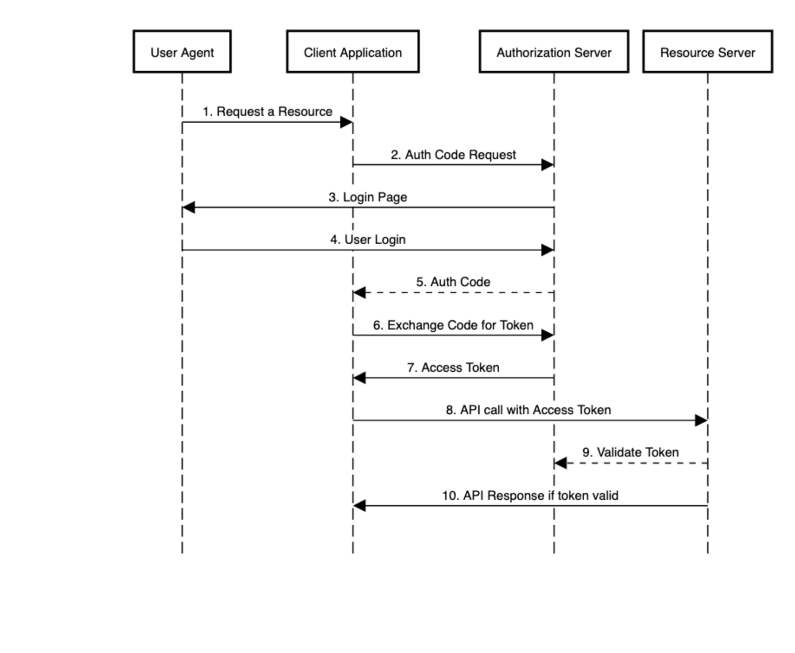

**INDICE**

- [Spring Security and OAuth 2.0](#spring-security-and-oauth-20)
  - [Notes and Definitions](#notes-and-definitions)
    - [JWT (JSON Web Token)](#jwt-json-web-token)
    - [Opaque token](#opaque-token)
    - [Resources Server](#resources-server)
    - [Authorization code Flow](#authorization-code-flow)
    - [Spring Boot Starter OAuth2 Resource Server](#spring-boot-starter-oauth2-resource-server)
    - [Resource Server component](#resource-server-component)
    - [JWK (Json Web Key) rfc7517](#jwk-json-web-key-rfc7517)
  - [Resources](#resources)

# Spring Security and OAuth 2.0
## Notes and Definitions
### JWT (JSON Web Token)
JWT è un modo per trasferire informazioni sensibili in formato JSOn.[RFC7519](https://datatracker.ietf.org/doc/html/rfc7519)

Garantisce che l'informazione contenuta sia stata effettivamente mandata da chi l'ha creato (è firmato). 

Non garantisce il criptaggio del contenuto (è un base64 facilmente leggibile, si veda ad esempio  [jwt.io](http://jwt.io))

### Opaque token
Si tratta di un token il cui contenuto non è inteso essere leggibile. Solo l'emittente (issuer) conosce il formato del token.

### Resources Server
Un  Resource Server è un'applicazione che protegge una risorsa tramite token OAuth. Questi token sono emessi da Authorization Server, indicati come emittenti (issuer).Obiettivo del Resource Server è quello di validare il token prima di servire la risorsa richiesta.

### Authorization code Flow



### Spring Boot Starter OAuth2 Resource Server
spring-boot-starter-oauth2-resource-server è lo starter spring per il supporto alla creazione di un resource server


### Resource Server component

* Model – the resource to protect
* API – a REST controller to expose the resource
* Security Configuration – a class to define access control for the protected resource that the API exposes
* application.yml – a config file to declare properties including information about the authorization server

### JWK (Json Web Key) [rfc7517](https://datatracker.ietf.org/doc/html/rfc7517)

Un strauttura JSOn che rappresenta un insieme di chiavi publiche

esempio
```json

{"jwk":
  [
    {"alg":"EC",
     "crv":"P-256",
     "x":"MKBCTNIcKUSDii11ySs3526iDZ8AiTo7Tu6KPAqv7D4",
     "y":"4Etl6SRW2YiLUrN5vfvVHuhp7x8PxltmWWlbbM4IFyM",
     "use":"enc",
     "kid":"1"},

    {"alg":"RSA",
     "mod": "0vx7agoebGcQSuuPiLJXZptN9nndrQmbXEps2aiAFbWhM78LhWx
4cbbfAAtVT86zwu1RK7aPFFxuhDR1L6tSoc_BJECPebWKRXjBZCiFV4n3oknjhMs
tn64tZ_2W-5JsGY4Hc5n9yBXArwl93lqt7_RN5w6Cf0h4QyQ5v-65YGjQR0_FDW2
QvzqY368QQMicAtaSqzs8KJZgnYb9c7d0zgdAZHzu6qMQvRL5hajrn1n91CbOpbI
SD08qNLyrdkt-bFTWhAI4vMQFh6WeZu0fM4lFd2NcRwr3XPksINHaQ-G_xBniIqb
w0Ls1jF44-csFCur-kEgU8awapJzKnqDKgw",
     "exp":"AQAB",
     "kid":"2011-04-29"}
  ]
}
```

## Resources
* https://www.baeldung.com/spring-security-oauth-resource-server
* https://jwt.io/
* https://datatracker.ietf.org/doc/html/rfc7519
* https://stackoverflow.com/questions/59158410/what-is-an-opaque-token
* https://openid.net/specs/openid-connect-discovery-1_0.html#ProviderConfig
* https://datatracker.ietf.org/doc/html/rfc7517
* https://openid.net/specs/draft-jones-json-web-key-03.html